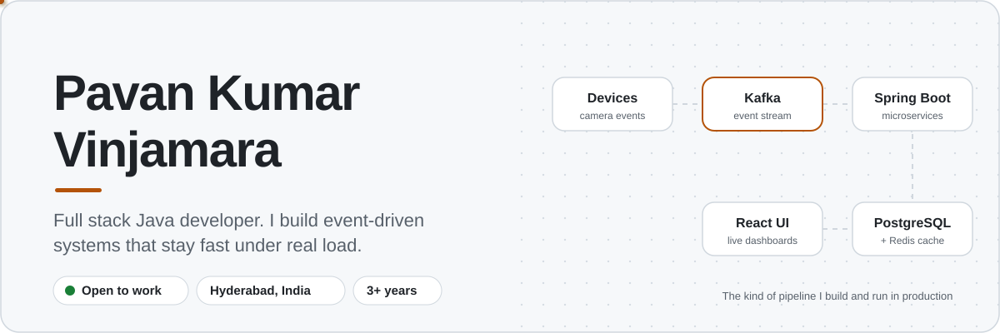
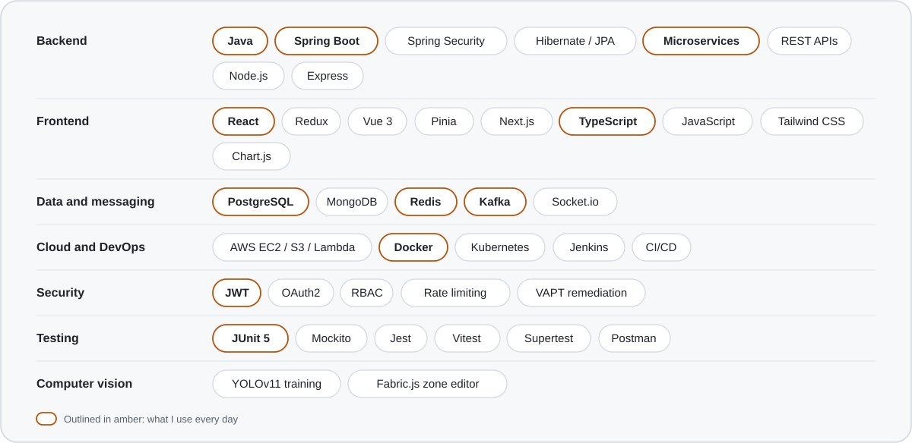

<!-- Profile README for Pavan Kumar Vinjamara.
     Every visual has a light and a dark version and switches with the viewer's GitHub theme. -->

  <picture>
    <source media="(prefers-color-scheme: dark)" srcset="./assets/header-dark.svg" />
    
  </picture>

  <a href="https://github.com/pavanvinjamara/pavanvinjamara/raw/main/Pavan_Kumar_Vinjamara_CV.pdf">
    <picture>
      <source media="(prefers-color-scheme: dark)" srcset="./assets/btn-cv-dark.svg" />
      
    </picture>
  </a>
  &nbsp;
  <a href="mailto:pavanvinjamara323@gmail.com">
    <picture>
      <source media="(prefers-color-scheme: dark)" srcset="./assets/btn-email-dark.svg" />
      
    </picture>
  </a>
  &nbsp;
  <a href="https://www.linkedin.com/in/YOUR-LINKEDIN-ID/">
    <picture>
      <source media="(prefers-color-scheme: dark)" srcset="./assets/btn-linkedin-dark.svg" />
      
    </picture>
  </a>

 

I'm a full stack developer at **Zygal**, where I own an AI camera-detection platform end to end: Spring Boot microservices, Kafka event pipelines, Redis caching, and the React dashboards operations teams use every day. I also built a vendor-operations platform for a financial-services client in Vue 3 and Node.js. I care about APIs that stay fast under load, security that holds up in an audit, and code a teammate can pick up on day one.

## Results I've shipped

<picture>
  <source media="(prefers-color-scheme: dark)" srcset="./assets/impact-dark.svg" />
  
</picture>

## What I work with

<picture>
  <source media="(prefers-color-scheme: dark)" srcset="./assets/stack-dark.svg" />
  
</picture>

## Selected work

Open a project to see what I built and what changed because of it.

<b>AI detection and camera management platform</b> Spring Boot · Kafka · Redis · React · Fabric.js · YOLOv11

 

- Owned 4 product modules from design through deployment, across frontend, backend and ML.
- Split a legacy monolith into Spring Boot microservices for camera, detection, device health and analytics. Deploys became zero-downtime, releases went **3x**, and deployment incidents fell **25%**.
- Designed Kafka pipelines for device-to-platform events, lifting throughput **40%** with reliable delivery.
- Fine-tuned YOLOv11 detection models on live camera feeds, halving manual review effort.
- Built a canvas editor for drawing detection zones, cutting zone setup time by **70%**.

<b>Vendor and service-operations platform</b> Vue 3 · Pinia · Node.js · Express · MongoDB · Socket.io

 

- Two portals, one for bank-side SOC staff and one for third-party vendors, each with its own role-based experience.
- JWT auth with httpOnly refresh cookies and RBAC across 5 roles, with strict per-vendor data isolation.
- SLA-tier and penalty engine covering breach detection, disputes, waivers and payment confirmation.
- Cross-vendor ticketing with real-time notifications, plus Excel bulk onboarding with row validation.
- Hardened with Helmet, rate limiting and Joi validation, and covered by **130+ automated tests**.

<b>Operations and analytics dashboard</b> Chart.js · Spring Boot · Redis

 

- Real-time KPI tiles, drill-down filters and exports over **1M+ detection records**, loading 45% faster.
- Automated device-health alerts by email and SMS, halving incident response time.

<b>Security and subscription management</b> JWT · RBAC · Rate limiting · VAPT

 

- Subscription-based feature gating across microservices for **10,000+ users**.
- Pricing tiers the product team can launch without a backend release.
- Found and shut down abusive API traffic with rate limiting, validation and IP filtering.
- Fixed VAPT findings so every release passed client security audits.

## How I got here

<picture>
  <source media="(prefers-color-scheme: dark)" srcset="./assets/journey-dark.svg" />
  
</picture>

## On GitHub

  <picture>
    <source media="(prefers-color-scheme: dark)" srcset="https://github-readme-stats.vercel.app/api?username=pavanvinjamara&show_icons=true&include_all_commits=true&count_private=true&hide_title=false&bg_color=0E1621&title_color=F5A524&text_color=C9D4E0&icon_color=2DD4BF&border_color=26354A&border_radius=16" />
    
  </picture>
  <picture>
    <source media="(prefers-color-scheme: dark)" srcset="https://github-readme-stats.vercel.app/api/top-langs/?username=pavanvinjamara&layout=compact&langs_count=6&bg_color=0E1621&title_color=F5A524&text_color=C9D4E0&border_color=26354A&border_radius=16" />
    
  </picture>

  <picture>
    <source media="(prefers-color-scheme: dark)" srcset="https://streak-stats.demolab.com/?user=pavanvinjamara&background=0E1621&border=26354A&stroke=26354A&ring=F5A524&fire=F5A524&currStreakNum=E6EDF3&sideNums=E6EDF3&currStreakLabel=F5A524&sideLabels=8B98A9&dates=8B98A9&border_radius=16" />
    
  </picture>

<picture>
  <source media="(prefers-color-scheme: dark)" srcset="https://raw.githubusercontent.com/pavanvinjamara/pavanvinjamara/output/snake-dark.svg" />
  
</picture>

 

  Hiring for backend or full stack roles? Email is the fastest way to reach me. 
  <a href="mailto:pavanvinjamara323@gmail.com"><b>pavanvinjamara323@gmail.com</b></a>

