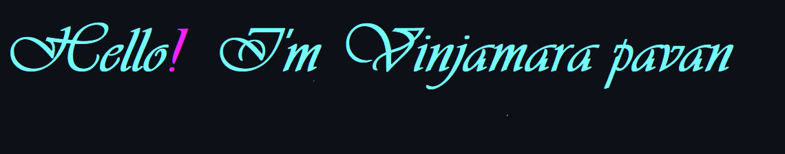

---

A mechanical engineer turned **`full stack developer`** with a passion for designing and building beautiful, user-friendly websites and applications. Proficient in HTML, CSS, JavaScript, Typescript, React, Java, NodeJs, ExpressJs, SpringBoot, MongoDB, Bootstrap and DataStructures and Algorithms. Through self-learning, personal projects and joining Fullstack Web Development Bootcamps, I have developed a strong understanding of front-end development principles and practices. I am excited to transition my skills to this dynamic field and contribute to meaningful projects.

 
 

- - 💼 Open to worK
- - 🌱 I’m currently learning javascript and react
- - 💬 Ask me about anything [here](https://github.com/pavanvinjamara/pavanvinjamara/issues)

|  |  |
| ------------- | ------------- |

### Languages

          

                  

                    
 

#  

<h2 align="center">Trophies</h2>

    

    

    
  

    

    
  

    

   
## My Contributions

